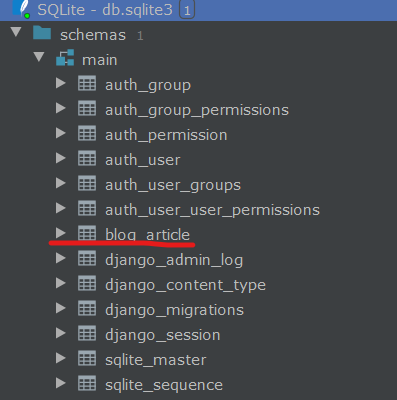

# Django 学习总结

## 相关资源网站

- 官方网站：https://www.djangoproject.com/
- 中文文档：https://docs.djangoproject.com/zh-hans/
- 安装文档：https://www.djangoproject.com/download/
- 源码：`git clone https://github.com/django/django.git`
- 对应python版本：https://docs.djangoproject.com/en/dev/faq/install/#what-python-version-can-i-use-with-django

## 什么是Django

Django是一个基于Python的高级Web开发框架，它能够让开发人员进行高效且快速的开发

## 安装

可参考官方安装文档，注意对应python版本，共有两种安装方式：

```shell script
pip install Django==2.2.4
```

或者下载正式版版本源码，解压进入根路径，执行：

```shell script
python setup.py install
```

安装完成后，将会多出命令 `django-admin`

## 创建一个项目 

```shell script
django-admin startproject myblog
```

将会在当前文件夹下创建一个 myblog 的项目，其中目录结构如下： 

```
myblog #目录名称不建议修改
    myblog
        __init__.py #用于声明模块
        settings.py #项目总配置文件、包含数据库、web应用、时间等配置
        urls.py #用于配置url，即页面地址
        wsgi.py #python web server getway interface python网关服务接口，python应用与web服务器之间的接口
    manage.py #项目与命令行交互的入口，项目管理器
```

> manage.py 中包含很多指令，给项目管理提供了相关接口，可以输入`python manage.py help` 指令，查看支持的执行参数

### 启动项目

执行项目，执行 `python manage.py runserver `运行web项目，此外还可以指定端口号:`python manage.py runserver 8000`:

```text
myblog> python manage.py runserver 8000                                                                                                                                                Watching for file changes with StatReloader                                                                                                                                                                              Performing system checks...

System check identified no issues (0 silenced).

You have 17 unapplied migration(s). Your project may not work properly until you apply the migrations for app(s): admin, auth, contenttypes, sessions.
Run 'python manage.py migrate' to apply them.
August 12, 2019 - 22:01:15
Django version 2.2.4, using settings 'myblog.settings'
Starting development server at http://127.0.0.1:8000/
Quit the server with CTRL-BREAK.
```

### 创建应用

一个Django包含多个应用，可以使用如下命令创建应用：

```shell script
# 创建一个名称为blog的应用，将会在当前路径下创建blog文件夹
python manage.py startapp blog
```

应用结构如下：

```text
blog
    migrations #数据移植迁移模块，数据库相关
        __init__.py 
    __init__.py
    admin.py #该应用的后台管理系统配置
    apps.py #当前应用的配置，1.9支持
    models.py #数据模型模块，ORM相关
    tests.py #测试模块
    views.py #执行响应的逻辑代码，类似controller层
```

#### 安装应用

```python
# 在settings.py上安装应用
INSTALLED_APPS = [
    'django.contrib.admin',
    'django.contrib.auth',
    'django.contrib.contenttypes',
    'django.contrib.sessions',
    'django.contrib.messages',
    'django.contrib.staticfiles',
    # 安装应用模块
    'blog',
]
```

### 创建web接口

在views.py中添加函数：
```python
from django.http import HttpResponse

def index(request):
    return HttpResponse('Hello Django')
```

#### 配置地址

在urls.py中注册接口地址： 

```python
urlpatterns = [
    path('admin/', admin.site.urls),
    path('index/', bv.index), #注册地址，类似路由
]
```

#### 引入配置地址

当项目越来越庞大时，urls.py 文件中定义的url也将会变得极其庞大与复杂，我们可以使用引用配置的方式，引入每个模块的url配置：

在应用模块中创建 `url.py` 文件：
```python
urlpatterns = [
    path('', bv.index),  # 使用http://localhost:8000/blog/访问
    path('index/', bv.index)  # 使用http://localhost:8000/blog/index访问
]
```

在根应用模块的urls.py中导入上述模块的url配置文件:
```python
from django.contrib import admin
# 导入include函数
from django.urls import include, path

urlpatterns = [
    path('admin/', admin.site.urls),
    path('blog/', include('blog.urls')),  # 注册blog模块的url，url配置位于blog模块下的urls文件中
]
```

### 创建模板引擎Template

默认的模板引擎使用 Django Template Language，简称 DTL，除此之外，还可以使用一些第三方的模板语言，比如Jinja2

#### 配置模板引擎

在settings.py配置文件中，TEMPLATES项就是用于配置模板引擎的：

```python
TEMPLATES = [
    {
        # 这里使用DjangoTemplates，如需更改，只需更改此字段即可
        'BACKEND': 'django.template.backends.django.DjangoTemplates',
        'DIRS': [],
        'APP_DIRS': True,
        'OPTIONS': {
            'context_processors': [
                'django.template.context_processors.debug',
                'django.template.context_processors.request',
                'django.contrib.auth.context_processors.auth',
                'django.contrib.messages.context_processors.messages',
            ],
        },
    },
]
```

#### 使用模板引擎

1. 创建模板引擎目录 `blog/templates`
2. 创建模板文件 `blog/templates/index.html`
3. 定义views函数，并使用`render(request, 'index.html', 传到页面的dict数据对象)`作为返回值

```python
urlpatterns = [
    path('', bv.index),  # 使用http://localhost:8000/blog/访问
    path('index/', bv.index),  # 使用http://localhost:8000/blog/index访问
    path('index.htm', bv.index_htm),
]
```

```python
def index_htm(request):
    return render(request, 'index.html')
```

#### 传递数据到模板引擎

```python
def index_htm(request):
    return render(request, 'index.html', {
        "name": "张三"
    })
```

```html
<h1>Hello {{name}}!!</h1>
```

#### 注意问题 

Django在查找模板时，按照 INSTALLED_APP的顺序，依次从templates文件夹中寻找模板，如果两个应用模板文件名称一致，Django将会始终去寻找位于前面的模板文件。

解决办法，在templates下创建一个应用名称文件夹，将模板文件放置到这个文件中即可。

### 使用Models

Model对应一张表，是ORM映射。

#### 定义实体

在模块根目录下，包含`models.py`文件，所有model class都放在此文件中：
```python
# 定义实体Model
from django.db import models

class Article(models.Model):
    # 字符串属性，长度为32
    title = models.CharField(max_length=32, default='title')
    # 长文本属性，可为空
    content = models.TextField(null=True)
``` 

#### 根据models.py生成model ORM对象

```shell script
python manage.py makemigrations app名称(即模块名称,可选)
```

例如：

```shell script
PS D:\OneDrive\Gitee\notes-django\myblog> python .\manage.py makemigrations
  Migrations for 'blog': # 使用默认app名称
    blog\migrations\0001_initial.py  # 初始化了一个migrations/0001_initial.py文件
      - Create model Article  # 生成了一个model
```

#### 生成表结构

```shell script
PS D:\OneDrive\Gitee\notes-django\myblog> python .\manage.py migrate                                                    Operations to perform:                                                                                                    Apply all migrations: admin, auth, blog, contenttypes, sessions
Running migrations:
  Applying contenttypes.0001_initial... OK
  Applying auth.0001_initial... OK
  Applying admin.0001_initial... OK
  Applying admin.0002_logentry_remove_auto_add... OK
  Applying admin.0003_logentry_add_action_flag_choices... OK
  Applying contenttypes.0002_remove_content_type_name... OK
  Applying auth.0002_alter_permission_name_max_length... OK
  Applying auth.0003_alter_user_email_max_length... OK
  Applying auth.0004_alter_user_username_opts... OK
  Applying auth.0005_alter_user_last_login_null... OK
  Applying auth.0006_require_contenttypes_0002... OK
  Applying auth.0007_alter_validators_add_error_messages... OK
  Applying auth.0008_alter_user_username_max_length... OK
  Applying auth.0009_alter_user_last_name_max_length... OK
  Applying auth.0010_alter_group_name_max_length... OK
  Applying auth.0011_update_proxy_permissions... OK
  Applying blog.0001_initial... OK
  Applying sessions.0001_initial... OK
```

可以看到 0001_initial 尽心了表迁移，下方的表则是 `settings.py`中`INSTALLED_APPS`配置的其他的APP的相关model

Django 默认使用sqlite3作为数据库，将会在根目录下生成 `db.sqlite3` 文件。使用工具连接SQLite文件后，可以看到如下表：



可以看到生成的表名为 APP名称_表名称。

#### 查看migrate命令建表的sql

既然migrate进行了表创建的功能，那么肯定会生成建表语句，使用如下命令可查看SQL：

```shell script
python manage.py sqlmigrate 应用名 文件id
```

例如： 

```shell script
PS D:\OneDrive\Gitee\notes-django\myblog> python manage.py sqlmigrate blog 0001                                         BEGIN;                                                                                                                  --
-- Create model Article
--
CREATE TABLE "blog_article" ("id" integer NOT NULL PRIMARY KEY AUTOINCREMENT, "title" varchar(32) NOT NULL, "content" text NULL);
COMMIT;
```

可以看到migrate为我们创建了Article表，并默认创立了自增主键 id